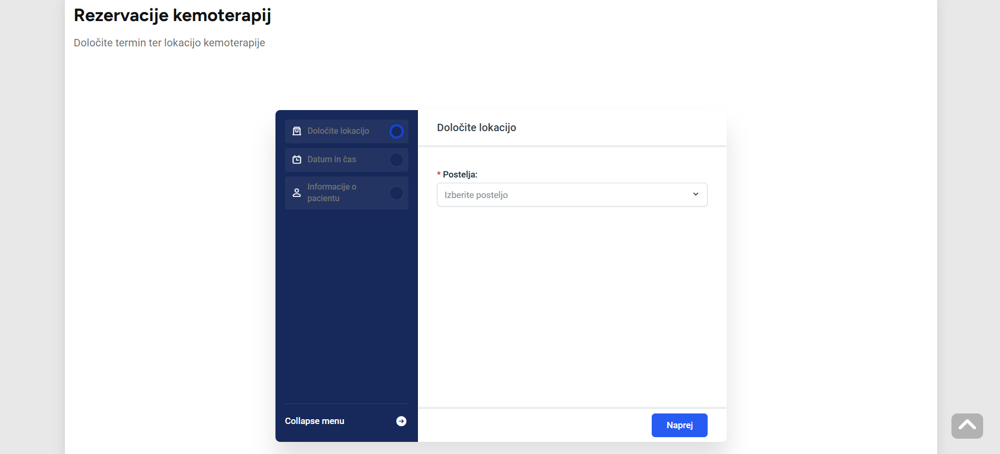
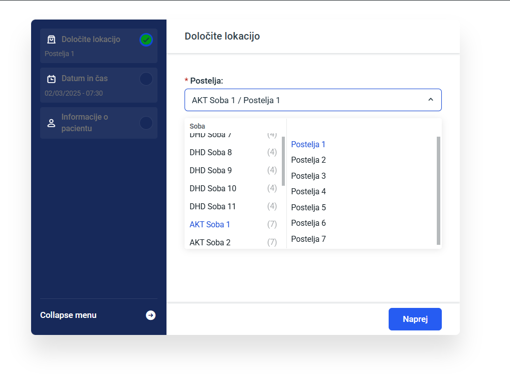
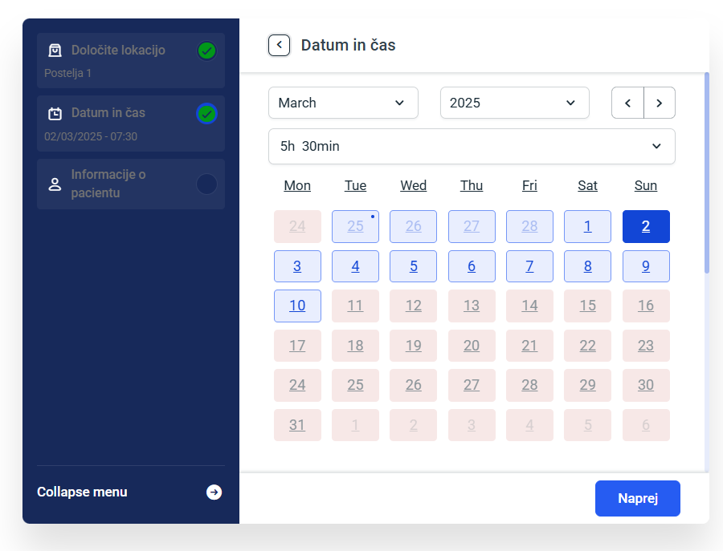
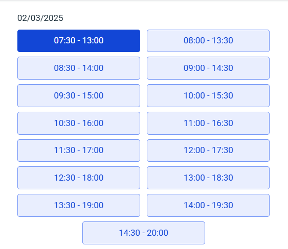
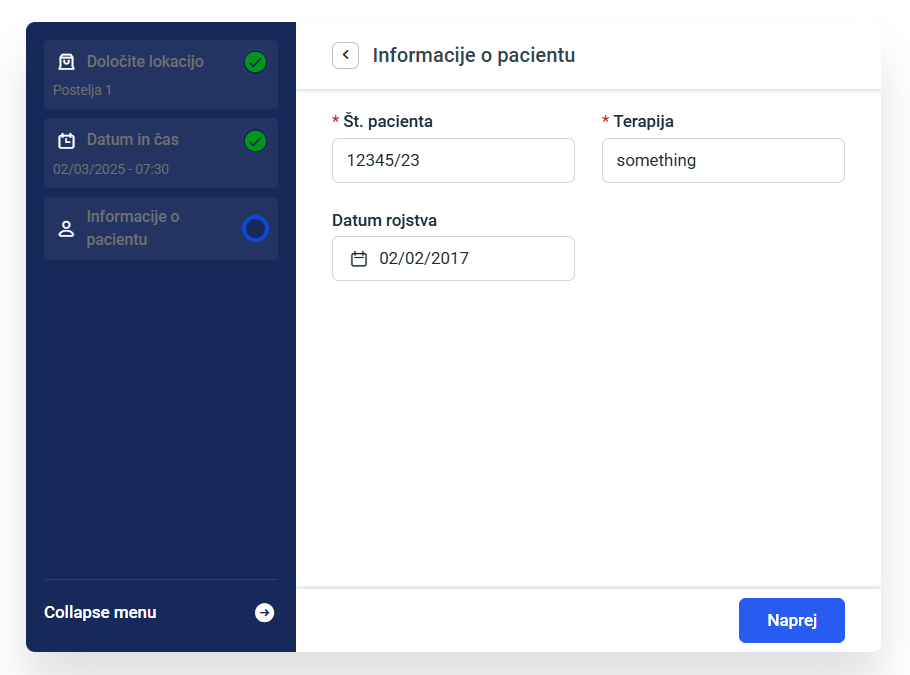
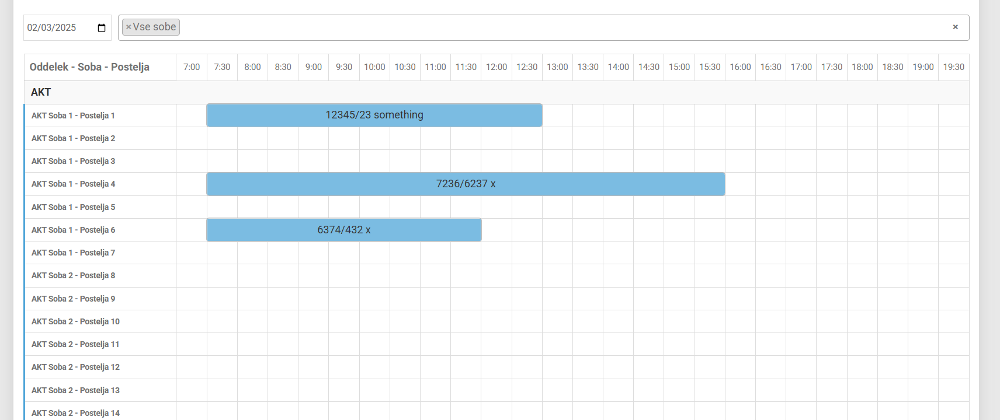
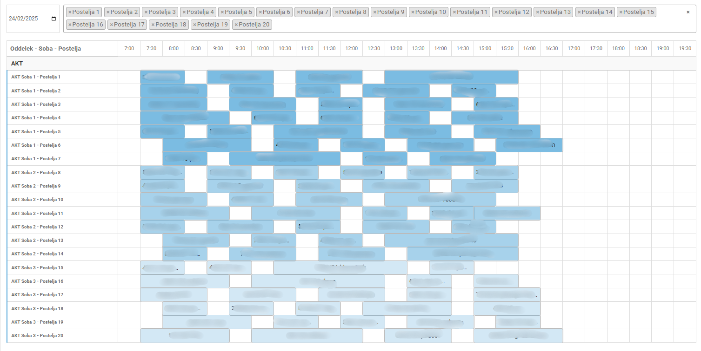

# Rezervacije Kemoterapij

## Overview
Rezervacije Kemoterapij is a specialized appointment management system for chemotherapy sessions. The system allows healthcare professionals to efficiently schedule and manage patient appointments across different departments, rooms, and beds.

## Purpose
This application addresses the complex scheduling needs of chemotherapy departments:
- Prevents double-booking of appointments
- Tracks which patient is assigned to specific beds, rooms, and departments
- Helps nurses distribute appointments optimally across available resources
- Provides a timeline view to visualize appointment distribution

## Features
- **Appointment Booking**: Form-based interface for scheduling chemotherapy appointments
- **Resource Management**: Track beds, rooms, and departments
- **Timeline View**: Custom visualization showing appointment distribution across departments
- **Persistent Filters**: Maintains date and room filtering preferences after page reload
- **Double-booking Prevention**: Ensures each resource is only booked once per time slot

## System Requirements
- WordPress 6.7.1 or higher
- Amelia Booking Plugin (paid plugin, not included in this repository)
- Media-Sync Plugin for logo management

## Project Structure
This repository contains:
- Custom plugin for timeline visualization and enhanced functionality
- WordPress theme customizations
- Configuration files (excluding sensitive information)

## Installation
1. Set up a standard WordPress installation (6.7.1 or higher)
2. Clone this repository into your WordPress directory
3. Purchase and install the Amelia Booking Plugin (essential for functionality)
4. Install the Media-Sync Plugin
5. Activate all plugins
6. Import any necessary media files for the site appearance

## Important Note
**This application requires the Amelia Booking Plugin to function properly.** The booking system will not work without this plugin as it provides the core appointment scheduling functionality. The custom plugin in this repository extends Amelia's capabilities with specialized features for chemotherapy appointment management.

## Custom Plugin Details
The custom plugin enhances the Amelia booking system with:
- Timeline visualization of appointments across departments
- Persistent filtering options that survive page refreshes
- Direct database integration with Amelia's appointment data
- Specialized interface for chemotherapy appointment management

## Screenshots

## Development
This project was developed for a healthcare facility to streamline their chemotherapy scheduling process, reducing administrative overhead and preventing scheduling conflicts.